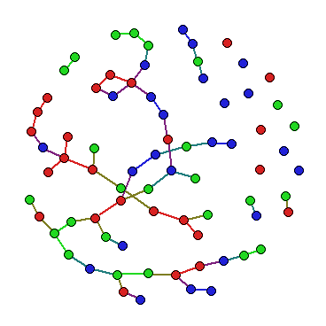
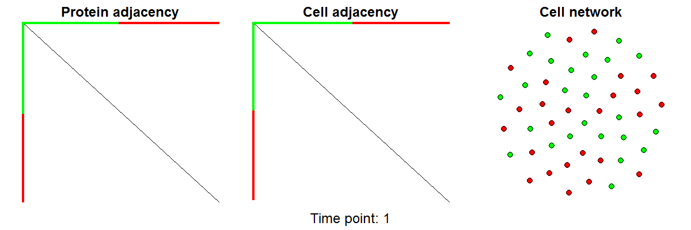

cellAggregator 
  ======================================================

Overview
--------

  **cellAggregator** is a network method that simulates cell-cell aggregation assays. cellAggregator takes user input of the number of proteins on the surface of each of the cells in disticnt populations, and simulates cell-cell adhesion according to a Markov Chain. Key metrics like overall population mixing are measured at each step and for the overall scenario.  
  
  Below is an animation of two cell populations with different proteins on the surface of the green and red cell populations. 
  


--------

Installation
--------

```r
# Install the development version from GitHub:
# install.packages("devtools")
devtools::install_github("shazanfar/cellAggregator")
library(cellAggregator)
```

Usage
-----

  The following example simulates the cell-cell aggregation of three populations expressing the same combinations of three separate proteins

```r
numCells = c(25,25,25)
numProtsPerCell = rbind(c(5,5,5),c(5,5,5), c(5,5,5))
bindingAffinity = cbind(c(1,0,0), c(0,1,0), c(0,0,1))

cellAggregationResult = cellAggregator(
  numCells,
  numProtsPerCell,
  bindingAffinity,
  timesteps = 100,
  burnIn = 0.75,
  verbose = TRUE,
  includeListOfGraphs = TRUE,
  plot = TRUE
)

cellAggregationResult$t_index
unlist(cellAggregationResult$listoftIndex)
cellAggregationBarplot(cellAggregationResult)


# another scenario, 2 populations and 3 proteins
numCells = c(25,25)
numProtsPerCell = rbind(c(5,0,0),c(5,5,5))
bindingAffinity = cbind(c(1,0,0), c(0,1,0), c(0,0,1))

cellAggregationResult = cellAggregator(
  numCells,
  numProtsPerCell,
  bindingAffinity,
  timesteps = 100,
  burnIn = 0.75,
  verbose = TRUE,
  includeListOfGraphs = TRUE,
  plot = TRUE
)

cellAggregationResult$t_index
unlist(cellAggregationResult$listoftIndex)
cellAggregationBarplot(cellAggregationResult)
```

## Author

* **Shila Ghazanfar**  - [@shazanfar](https://twitter.com/shazanfar)

